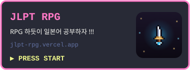
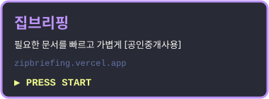
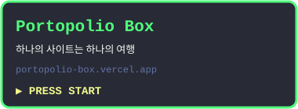

  <picture>
    <source media="(prefers-color-scheme: dark)" srcset="https://readme-typing-svg.demolab.com?font=Pixelify+Sans&size=26&pause=1000&color=FFE400&center=true&vCenter=true&width=600&height=60&lines=PLAYER+1+%3A+NOINO;READY+%3F+GO+!">
    
  </picture>

  
  <h3> 반가워요 ! 같이 하나씩 바꿔볼까요 ? </h3>   

  

<picture>
  <source media="(prefers-color-scheme: dark)" srcset="https://raw.githubusercontent.com/noino0819/noino0819/output/pacman-contribution-graph-dark.svg">
  <source media="(prefers-color-scheme: light)" srcset="https://raw.githubusercontent.com/noino0819/noino0819/output/pacman-contribution-graph.svg">
  
</picture>

  

  
  <picture>
    <source media="(prefers-color-scheme: dark)" srcset="https://readme-typing-svg.demolab.com?font=Pixelify+Sans&size=22&color=FFE400&center=true&vCenter=true&width=380&height=40&repeat=false&duration=1&lines=SKILL+INVENTORY">
    
  </picture>
  

<h3 align="center"> STAGE 1 · 언어 & 프레임워크</h3>

  

 

<h3 align="center"> STAGE 2 · 프론트엔드 & 웹</h3>

  

 

<h3 align="center"> STAGE 3 · 데이터베이스</h3>

  

 

<h3 align="center"> STAGE 4 · 클라우드 & 인프라</h3>

  

 

<h3 align="center"> STAGE 5 · 도구 & 협업</h3>

  

 

  
  
  
  
  

  

  
  <picture>
    <source media="(prefers-color-scheme: dark)" srcset="https://readme-typing-svg.demolab.com?font=Pixelify+Sans&size=22&color=FFE400&center=true&vCenter=true&width=520&height=40&repeat=false&duration=1&lines=NOW+PLAYING+-+MY+SERVICES">
    
  </picture>
  

  
  
   
  
  
   
  
  

  

  
  <picture>
    <source media="(prefers-color-scheme: dark)" srcset="https://readme-typing-svg.demolab.com?font=Pixelify+Sans&size=22&color=FFE400&center=true&vCenter=true&width=300&height=40&repeat=false&duration=1&lines=HIGH+SCORE">
    
  </picture>
  

  

  

  
  <picture>
    <source media="(prefers-color-scheme: dark)" srcset="https://readme-typing-svg.demolab.com?font=Pixelify+Sans&size=22&color=FFE400&center=true&vCenter=true&width=460&height=40&repeat=false&duration=1&lines=CONTINUE+%3F+-+CONTACT">
    
  </picture>

  

    
    
    
    
    

  

  <picture>
    <source media="(prefers-color-scheme: dark)" srcset="https://readme-typing-svg.demolab.com?font=Pixelify+Sans&size=18&pause=1200&color=00FFFF&center=true&vCenter=true&width=600&height=45&lines=GAME+CLEAR+!;THANK+YOU+FOR+PLAYING+!">
    
  </picture>

